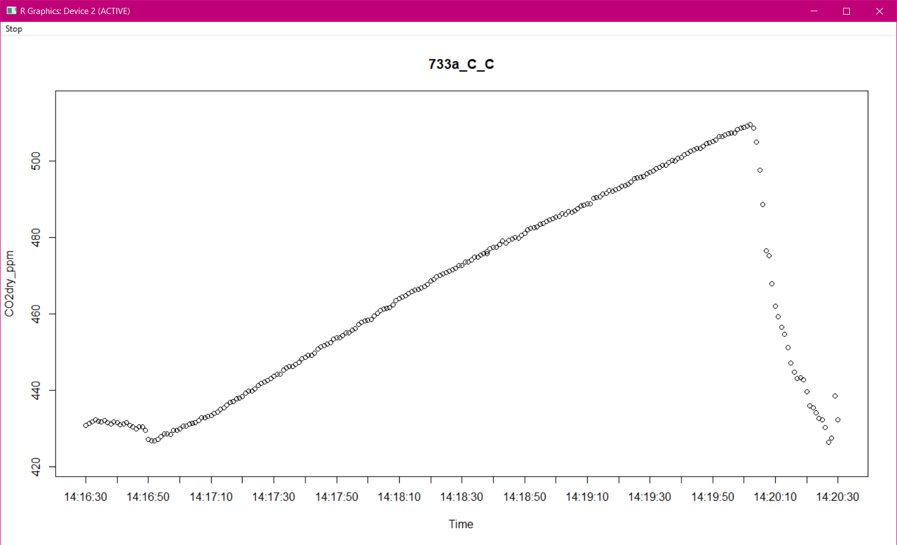
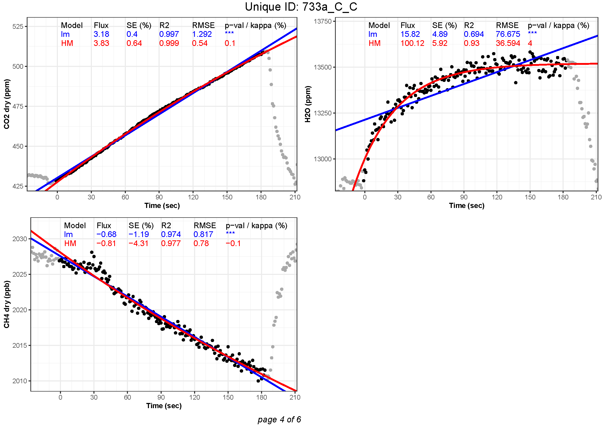

<!-- README.md is generated from README.Rmd. Please edit that file -->

# GoFluxYourself: A user-friendly way to calculate GHG fluxes yourself, regardless of user experience

#### BETA VERSION

The package is ready to use, but errors may still occur. Please report
any issues to the maintainer, Karelle Rheault (<karh@ign.ku.dk>),
including script and raw data if necessary. Thank you for helping me in
the development of this tool! 🙏

### One Package to rule them all

Non-steady state chambers are widely used for measuring soil greenhouse
gas (GHG) fluxes, such as CO<sub>2</sub>, CH<sub>4</sub>,
N<sub>2</sub>O, NH<sub>3</sub>, CO, and water vapor (H<sub>2</sub>O).
While linear regression (LM) is commonly used to estimate GHG fluxes,
this method tends to underestimate the pre-deployment flux
(*f*<sub>0</sub>). Indeed, a non-linearity is expected when gas
concentration increases inside a closed chamber, due to changes in
diffusion gradients between the soil and the air inside the chamber. In
addition, lateral gas flow and leakage contribute to non-linearity. Many
alternative to LM have been developed to try and provide a more accurate
estimation of *f*<sub>0</sub>, for instance the method of [Hutchinson
and Mosier (HM)
(1981)](https://doi.org/10.2136/sssaj1981.03615995004500020017x), which
was implemented in the [`HMR`](https://cran.r-project.org/package=HMR)
package by [Pedersen et al.,
2010](https://doi.org/10.1111/j.1365-2389.2010.01291.x). However,
non-linear models have a tendency to largely overestimate some flux
measurements, due to an exaggerated curvature. Therefore, the user is
expected to decide which method is more appropriate for each flux
estimate. With the advent of portable greenhouse gas analyzers
(e.g. [Los Gatos Research (ABB) laser gas
analyzers](https://new.abb.com/products/measurement-products/analytical/laser-gas-analyzers/laser-analyzers/lgr-icos-portable-analyzers)),
soil GHG fluxes have become much easier to measure, and more efficient
ways to calculate these flux estimates are needed in order to process
large amounts of data. A recent approach was developed by [Hüppi et al.,
2018](https://doi.org/10.1371/journal.pone.0200876) to restrict the
curvature in the HM model for a more reliable flux estimate. In the HM
model, the curvature is controlled by the kappa parameter. Hüppi et
al. suggest the use of the kappa.max to limit the maximal curvature
allowed in the model (see their R package
[`gasfluxes`](https://cran.r-project.org/package=gasfluxes), available
on the CRAN). This procedure introduces less arbitrary decisions in the
flux estimation process.

Previous software that have been developed to calculate GHG fluxes were
limited in many aspects that this package is meant to overcome. Most
were limited to the linear regression approach (e.g. [LI-COR
SoilFluxPro](https://www.licor.com/env/products/soil-flux/soilfluxpro),
[Flux
Puppy](https://www.sciencedirect.com/science/article/pii/S0168192319301522),
and the R packages [`flux`](https://cran.r-project.org/package=flux) and
[`FluxCalR`](https://github.com/junbinzhao/FluxCalR)), others were
compatible with only one designated system (e.g. [LI-COR
SoilFluxPro](https://www.licor.com/env/products/soil-flux/soilfluxpro),
[Flux
Puppy](https://www.sciencedirect.com/science/article/pii/S0168192319301522)),
and some were impractical with large amounts of measurements (e.g. the R
package [`HMR`](https://cran.r-project.org/package=HMR)) or simply did
not include data pre-processing (e.g. the R packages
[`HMR`](https://cran.r-project.org/package=HMR),
[`flux`](https://cran.r-project.org/package=flux) and
[`gasfluxes`](https://cran.r-project.org/package=gasfluxes)).

This new R package, `GoFluxYourself` is meant to be “student proof”,
meaning that no extensive knowledge or experience is needed to import
raw data into R, chose the best model to calculate fluxes (LM, HM or no
flux), quality check the results objectively and obtain high quality
flux estimates. The package contains a wide range of functions that
allows the user to import raw data from a variety of instruments
(LI-COR, LGR, GAIA2TECH, Gasmet and Picarro); calculate fluxes from a
variety of GHG (CO<sub>2</sub>, CH<sub>4</sub>, N<sub>2</sub>O,
NH<sub>3</sub>, CO and H<sub>2</sub>O) with both linear (LM) and
non-linear (HM) flux calculation methods; align instruments clocks after
data import; interactively identify measurements (start and end time) if
there are no automatic chamber recordings (e.g. LI-COR smart chamber);
plot measurements for easy visual inspection; and quality check the
measurements based on objective criteria and non-arbitrary thresholds.

> *Three R packages for the Elven-kings under the CRAN,  
> Seven for the Dwarf-lords in their halls of open software,  
> Nine for Mortal Men doomed to write scripts themselves,  
> One for the Dark Lady on her dark throne  
> In the Land of GitHub where the Shadows lie.  
> One Package to rule them all, One Package to find them,  
> One Package to bring them all and in the darkness bind them  
> In the Land of GitHub where the Shadows lie.*

## About the package

This package `GoFluxYourself` is meant to be “student proof”, meaning
that no extensive knowledge or experience is needed to import raw data
into R (except for knowing how to use R, of course), chose the best
model to calculate fluxes (LM or HM, that is the question. -Shakespeare,
1603), quality check the results objectively (hence the no experience
needed) and obtain high quality flux estimates from static chamber
measurements (wonderful!).

The package contains a wide range of functions that lets the user import
raw data from a variety of instruments:

- [**LI-COR trace gas
  analyzers**](https://www.licor.com/env/products/trace-gas/): LI-7810
  for CO<sub>2</sub>, CH<sub>4</sub> and H<sub>2</sub>O, LI-7820 for
  N<sub>2</sub>O and H<sub>2</sub>O
- [**LI-COR Smart
  Chamber**](https://www.licor.com/env/products/soil-flux/survey): for
  an easy import of data from any gas analyzer
- [**Los Gatos Research (ABB) laser gas
  analyzers**](https://new.abb.com/products/measurement-products/analytical/laser-gas-analyzers/laser-analyzers/lgr-icos-portable-analyzers):
  Ultra-portable Greenhouse Gas Analyzer (UGGA) and Microportable
  Greenhouse Gas Analyzer (MGGA) for CO<sub>2</sub>, CH<sub>4</sub> and
  H<sub>2</sub>O
- [**Picarro G2508 gas
  analyzer**](https://www.picarro.com/g2508_gas_concentration_analyzer):
  for CO<sub>2</sub>, CH<sub>4</sub>, N<sub>2</sub>O, NH<sub>3</sub> and
  H<sub>2</sub>O
- [**GAIATECH Automated ECOFlux
  chamber**](https://www.dmr.eu/technologies/gas-emission-measurements-eco2flux/automated-eco2flux-chamber/):
  for an easy import of data from any gas analyzer
- [**Gasmet
  DX4015**](https://www.gasmet.com/products/category/portable-gas-analyzers/dx4015/):
  portable analyzer for humid conditions. Measures CO, CO<sub>2</sub>,
  CH<sub>4</sub>, N<sub>2</sub>O, NH<sub>3</sub> and H<sub>2</sub>O.

After import, the user can chose from two methods for identification of
measurements:

- **Manual identification of measurements** - based on `start.time`,
  provided separately in an auxiliary file. The function `obs.win()`
  splits the imported data into a list of data frame (divided by
  `UniqueID`) and creates an observation window around the `start.time`
  to allow for a manual selection of the start and end points of each
  measurements, using the function `click.peak.loop()`.
- **Automatic selection of measurements** - based on automatic
  recordings of chamber opening and closing from an instrument such as
  the LI-COR Smart Chamber or the GAIATECH Automated ECOFlux chamber.

The function `goFlux()` calculates fluxes from a variety of greenhouse
gases (CO<sub>2</sub>, CH<sub>4</sub>, N<sub>2</sub>O, NH<sub>3</sub>,
CO, and H<sub>2</sub>O) using both linear (LM) and non-linear
(Hutchinson and Mosier) flux calculation methods.

Following flux calculation, the user can select the best flux estimate
(LM or HM) based on objective criteria and non-arbitrary thresholds,
using the `best.flux()` function:

- **Assumed non-linearity**: If all criteria are respected, the best
  flux estimate is assumed to be the non-linear estimate from the
  Hutchinson and Mosier model.
- **G-factor**: The g-factor is the ratio between the result of a
  non-linear flux calculation model (e.g. Hutchinson and Mosier; HM) and
  the result of a linear flux calculation model ([Hüppi et al.,
  2018](https://doi.org/10.1371/journal.pone.0200876)). With the
  `best.flux()` function, one can chose a limit at which the HM model is
  deemed to overestimate (*f*<sub>0</sub>). Recommended thresholds for
  the g-factor are \<4 for a flexible threshold, \<2 for a medium
  threshold, or \<1.25 for a more conservative threshold. The default
  threshold is `g.limit = 2`. If the g-factor is above the specified
  threshold, the best flux estimate will switch to LM instead of HM.
- **Minimal Detectable Flux**: The minimal detectable flux (MDF) is
  based on instrument precision and measurements time ([Christiansen et
  al., 2015](https://doi.org/10.1016/j.agrformet.2015.06.004)). Under
  the MDF, there is no detectable flux, but the function will not return
  a 0 to avoid heteroscedasticity of variances. There will simply be a
  comment in the columns “quality.check”, “LM.diagnose” or “HM.diagnose”
  saying that there is “No detectable flux (MDF)”. No best flux estimate
  is chosen based on MDF.
- **Kappa max**: The parameter kappa determines the curvature of the
  non-linear regression in the Hutchinson and Mosier model. A large
  kappa, returns a strong curvature. A maximum threshold for this
  parameter, kappa-max, is calculated based on the minimal detectable
  flux (MDF), the linear flux estimate and the measurement time ([Hüppi
  et al., 2018](https://doi.org/10.1371/journal.pone.0200876)). The
  units of the kappa-max is s<sup>-1</sup>. This limit of kappa-max is
  included in the `goFlux()` function, so that the non-linear flux
  estimate cannot exceed this maximum curvature. In the function
  `best.flux()`, one can choose the linear flux estimate over the
  non-linear flux estimate based on the ratio between kappa and
  kappa-max. The ratio is expressed as a percentage, where 1 indicates
  `HM.k = k.max`, and 0.5 indicates `HM.k = 0.5*k.max`. The default
  setting is `k.ratio = 1`.
- **Statistically significant flux (*p-value*)**: This criteria is only
  applicable to the linear flux. Under a defined *p-value*, the linear
  flux estimate is deemed non-significant, i. e., no detectable flux.
  The default threshold is `p.val = 0.05`. No best flux estimate is
  chosen based on *p-value*. If `LM.p.val < p.val`, a warning is given
  in the columns “quality.check” and “LM.diagnose”: “No detect. LM.flux
  (p-val)”.
- **Mean Absolute Error (MAE)**: This criteria is used to warned against
  “noisy” measurements: In a theoretical situation where the
  concentration inside the chamber is strictly diffusional and deviate
  from diffusion under non-steady state, a parameter such as MAE or RMSE
  reflects the instrument precision. Therefore, the instrument precision
  is used in the `best.flux()` function as a threshold for these
  parameters. To account for a larger noise in larger measurements, the
  threshold in the `best.flux()` function is the instrument precision
  plus 0.05% of the reading. If MAE is chosen as a criteria in
  `best.flux()`, the model with the smallest MAE is chosen, unless both
  of them are smaller than the instrument precision. In that case, the
  non-linear flux estimate is always chosen by default. If MAE is larger
  than the instrument precision, a warning is given in the columns
  “quality.check”, “LM.diagnose” or “HM.diagnose” saying “Noisy
  measurement (MAE)”. MAE and RMSE cannot both be selected.
- **Root Mean Square Error (RMSE)**: RMSE functions exactly like MAE.
  The difference between the two is that RMSE is much more sensitive to
  outliers. MAE will always return a smaller value than RMSE. MAE and
  RMSE cannot both be selected.
- **Relative Standard Error**: The delta method is used to propagate the
  total error of the flux calculation (`deltamethod()` from the `msm`
  package). The standard error is then divided by the flux estimate to
  obtain the relative standard error (%). This criteria is used as a
  warning of a potentially “bad measurement”. The default threshold is
  `SErel = 5`. Like MAE and RMSE, the smallest relative standard error
  between `LM.se.rel` and `HM.se.rel` selects for the best flux
  estimate, unless they are both under the threshold. In that case, the
  non-linear flux estimate is always chosen by default. If `LM.se.rel`
  and `HM.se.rel` are larger than the threshold, a warning is given in
  the columns “quality.check”, “LM.diagnose” or “HM.diagnose” saying
  “Noisy measurement (SE rel.)”.
- **Intercept**: If the initial gas concentration (*C<sub>0</sub>*)
  calculated for the flux estimates are more or less than 10% of the
  difference between *C<sub>0</sub>* and the final gas concentration at
  the end of the measurement (*C<sub>i</sub>*), a warning is issued in
  the columns “quality.check”, “LM.diagnose” or “HM.diagnose” saying
  “Intercept out of bounds”. Alternatively, one can provide boundaries
  for the intercept, for example: `intercept.lim = c(380, 420)` for a
  true *C<sub>0</sub>* of 400 ppm.
- **Number of observations**: Minimum amount of observations accepted
  (`nb.obs`). With nowadays portable greenhouse gas analyzers, the
  frequency of measurement is usually one measurement per second.
  Therefore, for a default setting of `warn.length = 60`, the chamber
  closure time should be approximately one minute (60 seconds). If the
  number of observations is smaller than the threshold, a warning is
  issued in the column “quality.check” saying “nb.obs \< 60”, for
  example.

Finally, after finding the best flux estimates, one can plot the results
and visually inspect the measurements using the function `flux.plot()`
and save the plots as pdf using `flux2pdf()`.

## How to use

Here is a simple example on how to use the package with a single raw
file from LGR gas analyzers.

> BETA VERSION
>
> The package is ready to use, but errors may still occur. Please report
> any issues to the maintainer, Karelle Rheault (<karh@ign.ku.dk>),
> including script and raw data if necessary. Thank you for helping me
> in the development of this tool! 🙏

### Installation

To install a package from GitHub, one must first install the package
`remotes` from the CRAN:

``` r
if (!require("remotes", quietly = TRUE)) install.packages("remotes")
```

Then, install the `GoFluxYourself` package from GitHub. If it is not the
first time you install the package, it must first be detached before
being updated.

> The package is actively being updated **every day**. To make sure that
> you are using the latest version, re-install the package every time
> you use it.

``` r
try(detach("package:GoFluxYourself", unload = TRUE), silent = TRUE)
remotes::install_github("Qepanna/GoFluxYourself")
```

**If prompted, it is recommended to update any pre-installed packages.**
The functioning of the package depends on many other packages
(`data.table`, `dplyr`, `ggnewscale`, `ggplot2`, `ggstar`, `graphics`,
`grDevices`, `grid`, `gridExtra`, `lubridate`, `minpack.lm`, `msm`,
`pbapply`, `plyr`, `purrr`, `rjson`, `rlist`, `SimDesign`, `stats`,
`stringr`, `tibble`, `tidyr`, `utils`), which will be installed when
installing `GoFluxYourself`.

Troubleshoot problems with `install_github()`:

- [Warning: package is in use and will not be
  installed](#warning-package-is-in-use-and-will-not-be-installed)
- [Error: API rate limit exceeded](#error-api-rate-limit-exceeded)

### Import raw data into R

``` r
library(GoFluxYourself)

# Get the example raw file from the package
file.path <- system.file("extdata", "LGR/LGR.txt", package = "GoFluxYourself")

# Import raw data from an LGR gas analyzer
?LGR_import
LGR_imp <- LGR_import(inputfile = file.path)
```

Note that raw data can also be imported from a multitude of other
instruments, and example data files are provided for all of them:

- LI-COR: LI-6400, LI-7810, LI-7820, LI-8100, LI-8200 (smart chamber)
- Los Gatos Research instruments: (e.g. UGGA and m-GGA)
- GAIA2TECH (DMR) automated chamber ECOFlux
- Picarro: G2508
- Gasmet: DX4015

To import multiple files from a folder, use the wrapper function
`import2RData()`.

``` r
# Get help for import functions from the GoFluxYourself package
?DX4015_import
?G2508_import
?GAIA_import
?LI6400_import
?LI7810_import
?LI7820_import
?LI8100_import
?LI8200_import
?import2RData
```

### Manual identification of measurements

In this example, the `start.time` for each measurement (`UniqueID`) was
noted manually in the field, and are provided in an auxiliary file
(`auxfile`).

``` r
# Other usefull packages
require(dplyr)
require(purrr)

# The auxfile requires start.time and UniqueID
# start.time must be in the format "%Y-%m-%d %H:%M:%S"
aux.path <- system.file("extdata", "LGR/LGR_aux.txt", package = "GoFluxYourself")
auxfile <- read.delim(aux.path) %>% 
  mutate(start.time = as.POSIXct(start.time, tz = "UTC"))
```

When running the function `click.peak()`, for each measurement, a window
will open, in which you must click on the start point and the end point.
The observation window is based on the `start.time` given in the
`auxfile`, the length of the measurement (`obs.length`), and a
`shoulder` before `start.time` and after `start.time + obs.length`. In
this example, the observation time is 3 minutes (180 seconds) and the
shoulder is 30 seconds. Therefore, the observation window shows 30
seconds before the `start.time` and 210 seconds after.

``` r
?obs.win

# Define the measurements' window of observation
LGR_ow <- obs.win(inputfile = LGR_imp, auxfile = auxfile,
                  obs.length = 180, shoulder = 30)
```



Pay attention to the warning message given by `obs.win()` when there are
more than 20 measurements (which is not the case in this example).

Note that for more than one gas measurement, it is better to use the
function `click.peak.loop()` with `lapply()` rather than using
`click.peak()` for each measurement individually.

``` r
?click.peak
?click.peak.loop

# Manually identify measurements by clicking on the start and end points
LGR_manID <- lapply(seq_along(LGR_ow), click.peak.loop, flux.unique = LGR_ow) %>%
  map_df(., ~as.data.frame(.x))
```

If the number of observation is under a certain threshold
(`warn.length = 60`), a warning will be given after clicking on the
start and end points as such:

    ## Warning message: Number of observations for UniqueID: 733_C_C is 59 observations

Otherwise, if the number of observation satisfies this threshold, then
the following message is given instead:

    ## Good window of observation for UniqueID: 733a_C_C

Between each measurement, the result of the `click.peak()` function is
displayed for 3 seconds. To increase this delay, change the parameter
`sleep` in the function `click.peak.loop()`.


To convert the flux estimate’s units into nmol
CO<sub>2</sub>/H<sub>2</sub>O m<sup>-2</sup>s<sup>-1</sup> or µmol
CH<sub>4</sub>/N<sub>2</sub>O m<sup>-2</sup>s<sup>-1</sup>, the
temperature inside the chamber (`Tcham`; °C) and the atmospheric
pressure inside the chamber (`Pcham`; kPa) are also required. If `Pcham`
and `Tcham` are missing, normal atmospheric pressure (101.325 kPa) and
normal air temperature (15 °C) are used.

Additionally, one must provide the surface area inside the chamber
(`Area`; cm<sup>2</sup>) and the total volume in the system, including
tubing, instruments and chamber (`Vtot`; L). If `Vtot` is missing, one
must provide an offset (distance between the chamber and the soil
surface; cm) and the volume of the chamber (`Vcham`; L). In that case,
the volume inside the tubing and the instruments is considered
negligible, or it should be added to `Vcham`.

The final output, before flux calculation requires: UniqueID, Etime,
flag, Vtot (or Vcham and offset), Area, Pcham, Tcham, H2O_ppm and other
gases.

### Flux calculation

The hardest part is now behind you. All that’s left is to run the flux
calculation with the `goFlux()` function. Then use the `best.flux()`
function to select the best flux estimates (LM or HM) with our list of
non-arbitrary thresholds, and plot the results for visual inspection.

``` r
# Flux calculation -------------------------------------------------------------
?goFlux
?best.flux

# Calculate fluxes for all gas types
CO2_flux <- goFlux(LGR_manID, "CO2dry_ppm", prec = 0.3)
CH4_flux <- goFlux(LGR_manID, "CH4dry_ppb", prec = 1.4)
H2O_flux <- goFlux(LGR_manID, "H2O_ppm", prec = 50)

# Use best.flux to select the best flux estimates (LM or HM)
# based on a list of criteria
CO2_flux_res <- best.flux(CO2_flux, criteria = c("MAE", "g.factor", "MDF"))
CH4_flux_res <- best.flux(CH4_flux, criteria = c("MAE", "g.factor", "MDF"))
H2O_flux_res <- best.flux(H2O_flux, criteria = c("MAE", "MDF"))

# Plots results ----------------------------------------------------------------
?flux.plot
?flux2pdf

# Make a list of plots of all measurements, for each gastype.
# With the function flux.plot, all parameters can be displayed.
# You can chose what parameters to display on the plots.
plot.legend = c("MAE", "RMSE", "k.ratio", "g.factor", "SErel")
plot.display = c("MDF", "prec", "nb.obs", "flux.term")
quality.check = TRUE

CO2_flux_plots <- flux.plot(CO2_flux_res, LGR_manID, "CO2dry_ppm", shoulder=20,
                            plot.legend, plot.display, quality.check)
CH4_flux_plots <- flux.plot(CH4_flux_res, LGR_manID, "CH4dry_ppb", shoulder=20,
                            plot.legend, plot.display, quality.check)
H2O_flux_plots <- flux.plot(H2O_flux_res, LGR_manID, "H2O_ppm", shoulder=20, 
                            plot.legend, plot.display, quality.check)

# Combine plot lists into one list
flux_plot.ls <- c(CO2_flux_plots, CH4_flux_plots, H2O_flux_plots)

# Save plots to pdf
flux2pdf(flux_plot.ls, outfile = "demo.results.pdf")
```

Here is an example of how the plots are saved as pdf:



You can then save the results as RData or in an Excel sheet to further
process the results.

``` r
require(openxlsx)

# Save RData
save(CO2_flux_res, file = "CO2_flux_res.RData")
save(CH4_flux_res, file = "CH4_flux_res.RData")
save(H2O_flux_res, file = "H2O_flux_res.RData")

# Save to Excel
write.xlsx(CO2_flux_res, file = "CO2_flux_res.xlsx")
write.xlsx(CH4_flux_res, file = "CH4_flux_res.xlsx")
write.xlsx(H2O_flux_res, file = "H2O_flux_res.xlsx")
```

## Troubleshoot problems with `install_github()`

### Warning: package is in use and will not be installed

If you get this warning while trying to install an R package from
GitHub:

    ## Warning: package ‘GoFluxYourself’ is in use and will not be installed

This error means that the package is loaded. Before re-installing the
package, you must first detach it:

``` r
detach("package:GoFluxYourself", unload = TRUE)
```

If this does not solve the problem, restart your session and try again.

------------------------------------------------------------------------

### Error: API rate limit exceeded

If you get this error while trying to install an R package from GitHub:

    ## Error: Failed to install 'GoFluxYourself' from GitHub:
    ##   HTTP error 403.
    ##   API rate limit exceeded for xxx.xxx.xxx.x (But here's the good news: Authenticated requests get a higher rate limit. Check out the documentation for more details.)
    ## 
    ##   Rate limit remaining: 0/60
    ##   Rate limit reset at: 2023-10-16 09:08:07 UTC
    ## 
    ##   To increase your GitHub API rate limit
    ##   - Use `usethis::create_github_token()` to create a Personal Access Token.
    ##   - Use `usethis::edit_r_environ()` and add the token as `GITHUB_PAT`.

#### Step 1: Set up a GitHub account

**Go to <https://github.com/join> .**

1.  Type a user name, your email address, and a password.

2.  Choose Sign up for GitHub, and then follow the instructions.

#### Step 2: Create a GitHub token

Run in R:

``` r
usethis::create_github_token()
```

On pop-up website, generate and copy your token.

#### Step 3: Set your GitHub PAT from R

Run in R with your own token generated in step 2:

``` r
credentials::set_github_pat("YourTokeninStep2")
```

## Community Guidelines

Authors: Karelle Rheault and Klaus Steenberg Larsen

To report problems, seek support or contribute to the package, please
contact the maintainer, Karelle Rheault (<karh@ign.ku.dk>). Suggestions
for new features or improvements are always welcome.
