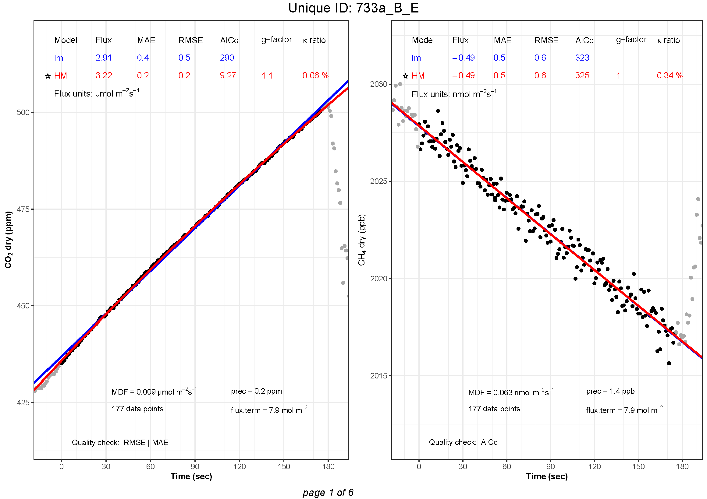

```{r}
#| include: false
source("scripts/autodoc.R")
```

Finally, after finding the best flux estimates, the user can plot the results and visually inspect the measurements using the function `flux.plot` and save the plots as pdf using `flux2pdf`.

### `flux.plot`

::: {.callout-note}
Code chunks under **Usage** sections are not part of the demonstration. They are meant to show how to use the function arguments.
:::

```{r}
#| echo: false
#| results: asis
cat(autodoc("flux.plot", level = 4))
```

#### Usage tips
::: callout-tip
To lighten your script, you can define arguments outside a function by storing their value in an object that is then used in the function instead. However, remember to use the arguments in the same order as they are required in the function.

```{r}
#| eval: false

# best.flux
criteria = c("MAE", "AICc", "g.factor", "MDF")

CO2_best <- best.flux(CO2_flux, criteria)
CH4_best <- best.flux(CH4_flux, criteria)

# flux.plot 
plot.legend = c("MAE", "RMSE", "AICc", "k.ratio", "g.factor")
plot.display = c("MDF", "prec", "nb.obs", "flux.term")
quality.check = TRUE

CO2_plots <- flux.plot(CO2_best, manID.UGGA, "CO2dry_ppm", shoulder=20,
                       plot.legend, plot.display, quality.check)
CH4_plots <- flux.plot(CH4_best, manID.UGGA, "CH4dry_ppb", shoulder=20,
                       plot.legend, plot.display, quality.check)
```

This trick can help you reduce repetition and mistakes in your script.
:::

::: callout-tip
#### Tip: Combine all gases in one pdf

The function `flux.plot` creates a list of plots, one per UniqueID. Multiple lists (e.g. one per `gastype`) can be combined to save all plots together with the `flux2pdf` function.

```{r}
#| eval: false
# Combine plot lists into one list
plot.list <- c(CO2_plots, CH4_plots)
```
:::

#### Value

The function returns a list of plots, one per `UniqueID`, drawn from flux results (output from the functions `goFlux` and `best.flux`).


### `flux2pdf`

The list of plots created with `flux.plot` can now be saved as a pdf using the function `flux2pdf`.

```{r}
#| echo: false
#| results: asis
cat(autodoc("flux2pdf", level = 4))
```

Here is an example of how the plots are saved as pdf:

{#fig-flux2pdf fig-align="center"}
